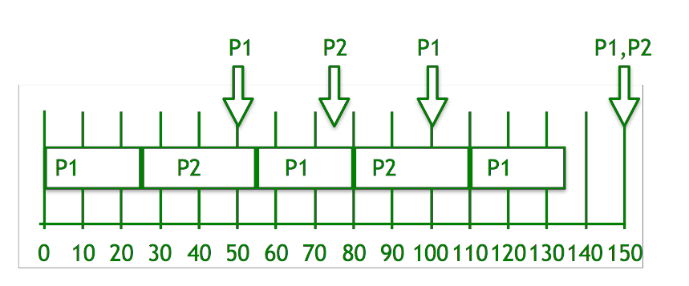
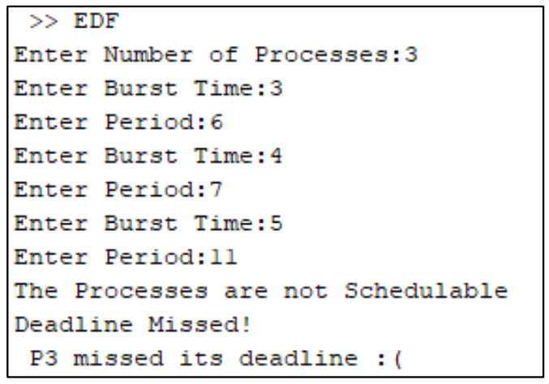
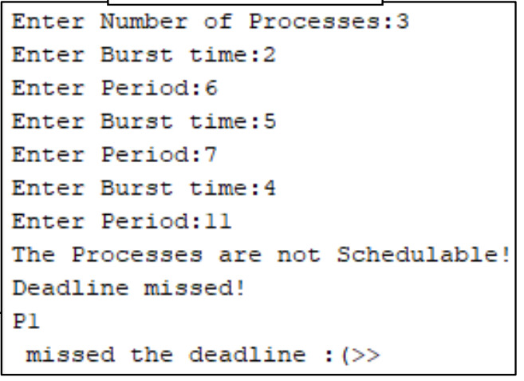
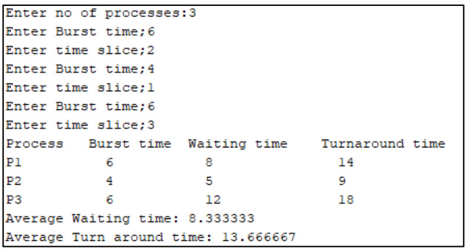

# Scheduling
 ERR, WRR, RM Scheduling Algorithms
 
CPU Scheduling is a process of determining which process will own CPU for execution while another process is on hold. The main task of CPU scheduling is to make sure that whenever the CPU remains idle, the OS at least select one of the processes available in the ready queue for execution. The selection process will be carried out by the CPU scheduler. It selects one of the processes in memory that are ready for execution.

## Types of CPU Scheduling

Here are two kinds of Scheduling methods:

### Preemptive Scheduling

In Preemptive Scheduling, the tasks are mostly assigned with their priorities. Sometimes it is important to run a task with a higher priority before another lower priority task, even if the lower priority task is still running. The lower priority task holds for some time and resumes when the higher priority task finishes its execution.

### Non-Preemptive Scheduling

In this type of scheduling method, the CPU has been allocated to a specific process. The process that keeps the CPU busy will release the CPU either by switching context or terminating. It is the only method that can be used for various hardware platforms. That’s because it doesn’t need special hardware (for example, a timer) like preemptive scheduling.

## Earliest Deadline First Scheduling (EDF)

EDF uses priorities to the jobs for scheduling. It assigns priorities to the task according to the absolute deadline. The task whose deadline is closest gets the highest priority. The priorities are assigned and changed in a dynamic fashion. EDF is very efficient as compared to other scheduling algorithms in real-time systems. It can make the CPU utilization to about 100% while still guaranteeing the deadlines of all the tasks.

  

   * Deadline pf P1 is earlier, so priority of P1>P2.
   * Initially P1 runs and completes its execution of 25 time.
   * After 25 times, P2 starts to execute until 50 times, when P1 is able to execute.
   * Now, comparing the deadline of (P1, P2) = (100, 75), P2 continues to execute.
   * P2 completes its processing at time 55.
   * P1 starts to execute until time 75, when P2 is able to execute.
   * Now, again comparing the deadline of (P1, P2) = (100, 150), P1 continues to execute.
   * Repeat the above steps…
   * Finally at time 150, both P1 and P2 have the same deadline, so P2 will continue to execute till its processing time after which P1 starts to execute.

## Rate Monotonic (RM) Scheduling

Rate monotonic scheduling is a priority algorithm that belongs to the static priority scheduling category of Real Time Operating Systems. It is preemptive in nature. The priority is decided according to the cycle time of the processes that are involved. If the process has a small job duration, then it has the highest priority. Thus if a process with highest priority starts execution, it will preempt the other running processes. The priority of a process is inversely proportional to the period it will run for.

## Weighted Round Robin (WRR)

In Round-robin scheduling, each ready task runs turn by turn only in a cyclic queue for a limited time slice. This algorithm also offers starvation free execution of processes.
Weighted round robin is a generalisation of round-robin scheduling. It serves a set of queues or tasks. Whereas round-robin cycles over the queues or tasks and gives one service opportunity per cycle, weighted round robin offers to each a fixed number of opportunities, as specified by the configured weight which serves to influence the portion of capacity received by each queue or task.

## Sample Input

### EDF

### RM

### WRR

